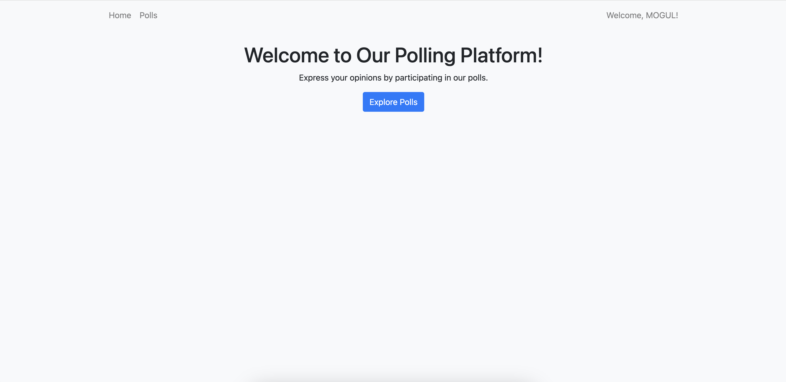
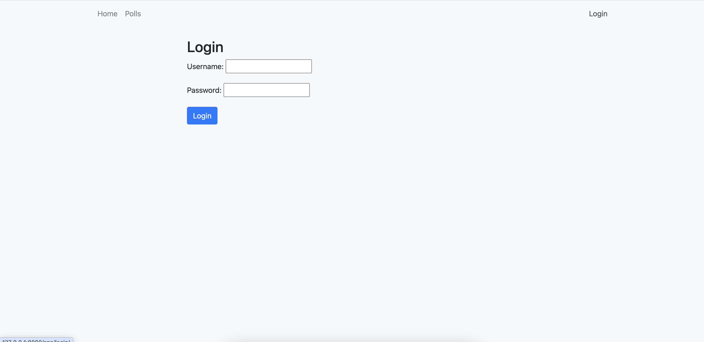
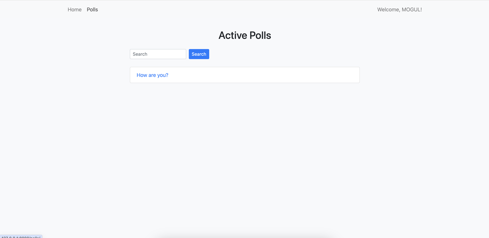

# Todo

### Getting Started

```bash
pip install -r requirements.txt
```

```bash
python manage.py makemigrations
python manage.py migrate
```

```bash
python manage.py runserver
```

### Home Page



### Login Page



### Listing Page



### Details Page


### Results Page

